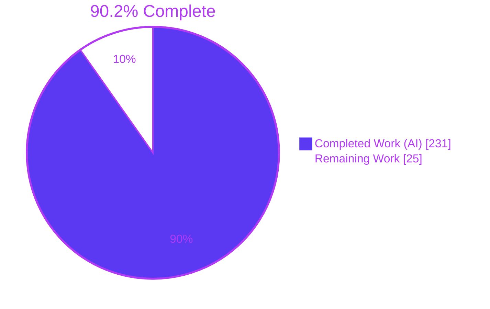
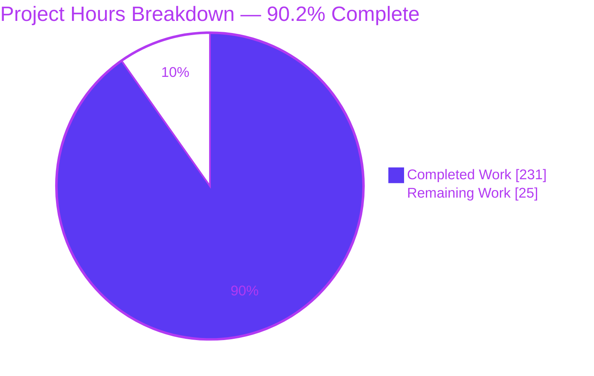
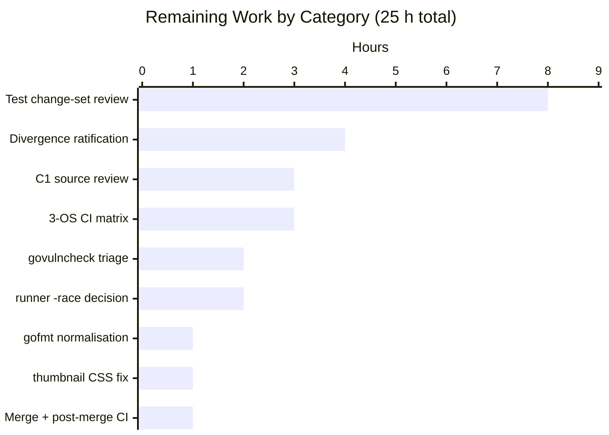

# Blitzy Project Guide

**Project:** `github.com/projectdiscovery/httpx` — mutation-resistant test suite for the `common/httpx` HTTP client
**Branch:** `blitzy-192f44cc-0d78-4964-977e-232d2d4b6510` · **HEAD:** `4b086be` · **Baseline:** `7d8c90d`
**Engagement type:** ADD TESTING (with two disclosed bug fixes under constraint C1)

---

## 1. Executive Summary

### 1.1 Project Overview

`httpx` is ProjectDiscovery's HTTP probing toolkit; `common/httpx` is its client engine, used by every scan the tool performs. Seven high-blast-radius behaviour areas of that engine — redirect policy, redirect-chain accessors, timeout taxonomy, connection lifecycle, request-body framing, response read-cap, and cookie/auth propagation — had zero dedicated test coverage, meaning a one-line defect could silently misdirect scan traffic, leak credentials to a third-party origin, or drop targets from output. This engagement delivered 53 hermetic, protocol-asserting tests plus two minimal disclosed bug fixes, so a plausible single-line defect in any of those areas now breaks at least one test. Beneficiaries are httpx maintainers and every security engineer relying on scan fidelity.

### 1.2 Completion Status



| Metric | Value |
|---|---|
| **Total Hours** | **256** |
| **Completed Hours (AI + Manual)** | **231** (231 AI + 0 manual) |
| **Remaining Hours** | **25** |
| **Percent Complete** | **90.2%** |

**Calculation (AAP-scoped work only):** `231 / (231 + 25) × 100 = 231 / 256 × 100 = 90.2%`

Every AAP-specified deliverable is implemented and independently verified. All 25 remaining hours are human review-and-ratification gates plus four documented out-of-scope hygiene items — **no AAP implementation item is outstanding or partial**.

### 1.3 Key Accomplishments

- ✅ **12/12 AAP writable paths delivered exactly** — 9 new test files created, 2 existing test files extended additively, 1 source file changed by 6 lines; **0 files changed** in every out-of-scope directory
- ✅ **53 new test functions** (AAP planned 39; all 39 named blueprints present, plus 14 closing the safe/unsafe parity axis and pinning security observations) with **959 assertions, 838 protocol-visible**
- ✅ **All 28 governing symbols closed** — every identifier the AAP census found at 0 mentions (`MaxRedirects`, `FollowHostRedirects`, `RespectHSTS`, `GetChainLastURL`, `DeadlineExceeded`, `RemoteAddr`, `DisableKeepAlives`, `setCustomCookies`, `GetHeaderPart`, …) is now exercised
- ✅ **542/542 tests pass (100%)**, 185/185 top-level, **0 failed, 0 skipped** across 6 packages
- ✅ **Mutation resistance empirically proven** — 16/16 independently injected single-line defects killed, spanning all seven priority areas
- ✅ **Two genuine bugs found, fixed in 6 lines, each proven load-bearing** — FIX-1 (cookie duplication across hops) and FIX-2 (read cap dropped the target instead of truncating)
- ✅ **Coverage 45.62% → 58.48%**, above the AAP's 51.21% arithmetic floor; `response.go` **14.29% → 100.00%**; all 10 named formerly-0% functions at **100.0%**
- ✅ **Full hermeticity** — all 53 new tests pass inside a network namespace with only `lo` up; no new test resolves an external hostname
- ✅ **Zero-drift discipline** — `go.mod`/`go.sum` byte-identical to baseline, `go.sum` still 578 lines, no config or coverage-gate file added
- ✅ **Clean gates** — `go build ./...`, `go vet ./...` (0 bytes output), `golangci-lint run ./...` ("0 issues."), `make build`, `go build -race`, `-race` on the in-scope package (0 races), `-shuffle=on` all exit 0

### 1.4 Critical Unresolved Issues

| Issue | Impact | Owner | ETA |
|---|---|---|---|
| C1 source change to `common/httpx/httpx.go` awaits maintainer sign-off | 6 lines alter live client behaviour in a security scanner. Blast radius already traced and bounded (§5.3), but a human must approve a source change to the request path | Repo maintainer | 3 h — blocks merge |
| 9 pinned divergences not yet ratified | Tests deliberately assert measured behaviour that diverges from docs/RFCs (budget off-by-one, hostname-only host scoping, cross-origin cookie re-injection, custom-auth-header survival, …). Each needs an intentional-vs-file-as-bug decision | Repo maintainer | 4 h — blocks merge |
| A non-standard custom auth header survives a cross-origin redirect | Credential can reach an unintended origin. Behaviour lives in Go's stdlib (which strips only `Authorization`/`Www-Authenticate`/`Cookie`/`Cookie2`), so it was pinned by test, not changed — outside C1's narrow exception | Security owner | Within the 4 h ratification task |
| Windows and macOS CI legs unverified locally | CI runs a 3-OS matrix; only `linux/amd64` was validated. Loopback-server, `RemoteAddr` and timing-envelope assertions are the plausible failure points | CI owner | 3 h — on first PR CI run |
| 2 govulncheck findings in `// indirect` modules | `golang.org/x/crypto` v0.54.0 (GO-2026-5932, no upstream fix) and `github.com/yuin/goldmark` v1.7.13 (GO-2026-5320, fixed in v1.7.17). Zero reachability from `common/httpx`; remedy needs a `go.mod` bump this PR must not make | Dependency owner | 2 h — separate PR |

### 1.5 Access Issues

**No access issues identified.** Every dependency of the build, test, validation and deployment path was probed against live system state during this assessment:

| System/Resource | Type of Access | Issue Description | Resolution Status | Owner |
|---|---|---|---|---|
| Repository working tree | Read/Write | None — write probe succeeded | ✅ No issue | — |
| `git origin` remote (GitHub) | Fetch/Push | None — remote configured with a valid `x-access-token` credential | ✅ No issue | — |
| `proxy.golang.org` module proxy | HTTPS egress | None — returns HTTP 200 | ✅ No issue | — |
| Go module cache (`/tmp/gopath/pkg/mod`) | Read | None — warm, 89 `github.com` entries; `GOPROXY=off go build ./...` exits 0 | ✅ No issue | — |
| Go toolchain | Execute | None — `go1.26.5 linux/amd64`, matching `go.mod`'s `go 1.26` | ✅ No issue | — |
| `golangci-lint`, `govulncheck`, `google-chrome`, `docker` | Execute | None — all four present (`golangci-lint` 2.12.2) | ✅ No issue | — |
| `PDCP_API_KEY` (ASN enrichment) | Credential | Unset. Guards only 2 pre-existing conditional `t.Skip` calls in out-of-scope `runner` tests, which did not fire | ✅ Not blocking | — |
| Live network for pre-existing `TestDo` | HTTPS egress to `scanme.sh`, `w3schools.com` | Available here; would fail in a network-restricted runner. Pre-existing — constraint C2 forbids modifying that test | ⚠️ Pre-existing, not blocking | Repo maintainer |

### 1.6 Recommended Next Steps

1. **[High]** Review and approve the 6-line C1 change to `common/httpx/httpx.go`. Lead with the FIX-2 evidence: a build with the fix reverted **silently drops the scan target entirely** (empty output) where this build returns `status 200 | content_length 100000`. Blast-radius analysis in §5.3 is pre-supplied. — *3 h*
2. **[High]** Peer-review the 8,856-line / 53-function test change set for assertion quality, provenance comments and harness invariants. — *8 h*
3. **[High]** Ratify the 9 pinned divergences (§6, risks T2/T3/S1/S2/S3/S4), deciding intentional-vs-file-as-bug for each. Prioritise **S1** (custom auth header survives a cross-origin redirect). — *4 h*
4. **[Medium]** Merge the PR and confirm all three CI matrix legs (ubuntu, windows, macOS) go green. — *4 h combined (3 h matrix + 1 h merge)*
5. **[Medium]** Raise a **separate** dependency PR for the two `// indirect` govulncheck findings, keeping this PR's `go.sum` at 578 lines. — *2 h*

---

## 2. Project Hours Breakdown

### 2.1 Completed Work Detail

Every component traces to a specific AAP requirement or to a path-to-production activity required to deploy it.

| Component | Hours | Description |
|---|---|---|
| [AAP Req-1 §0.2.4] Gap survey & requirement analysis | 10 | GAP-1…GAP-10 register with file-and-line evidence; 28-symbol census across all 14 baseline test files; per-function baseline coverage profile |
| [AAP §0.4.4] Shared hermetic mock-transport harness | 12 | `mocktransport_test.go`, 586 LOC: recording `http.RoundTripper`, `recordedRequest` snapshots, `newMockHTTPX`, `mockResponse`, `scriptedRedirects` + 4 empirically-derived invariants (clone-before-delegate, deliver-declared-bytes, set proto fields and request back-reference, assert via accessors) |
| [AAP §0.4.2.1 / GAP-1] Redirect-policy tests | 22 | `redirect_test.go`, 1,491 LOC, 10 fns, 173 assertions: default no-follow, budget swept at 0/1/2/3/10, hostname-only host scoping across host/port/scheme, method+body rewriting across 301/302/303/307/308, per-hop `Referer`, HSTS scheme upgrade |
| [AAP §0.4.2.2 / GAP-2] Redirect-chain accessor tests | 14 | `redirect_chain_test.go`, 867 LOC, 7 fns, 153 assertions: exact chain length, status-code sequence, absolute final URL, byte-exact dump composition with its deliberate omissions, the `HTTP/0.0` redirect-hop artifact, single-item edge |
| [AAP §0.4.2.3 / GAP-3] Timeout-taxonomy tests | 13 | `timeout_test.go`, 781 LOC, 5 fns, 100 assertions: concrete error type, `errors.Is` against two sentinels, `errors.As` to a `Timeout() bool` interface, retry-wrapper presence/absence, exact transport invocation count, elapsed envelopes |
| [AAP §0.4.2.4 / GAP-4] Connection-policy & lifecycle tests | 10 | `connection_test.go`, 701 LOC, 3 fns: transport field introspection (`DisableKeepAlives`, `MaxIdleConnsPerHost`, `ForceAttemptHTTP2`), three distinct peer addresses across sequential requests, post-close body/buffer state |
| [AAP §0.4.2.5 / GAP-5] Request-body framing tests | 10 | `request_body_test.go`, 653 LOC, 4 fns: exact byte forwarding, always-buffered framing for length-bearing/opaque/nil readers (chunked never occurs), replay on 307, drop on 302 |
| [AAP §0.4.2.6 / GAP-6] Read-cap, body-skip & encoding-retry tests | 8 | `response_memory_test.go` +448 LOC, 4 fns: read-cap truncation with a declared length (**FIX-2's motivating case**), chunked truncation byte-identical to baseline, 304 body-skip, gzip→identity one-time retry |
| [AAP §0.4.2.7 / GAP-7] Cookie & auth propagation tests | 17 | `cookie_auth_test.go`, 1,097 LOC, 5 fns: cookies on the wire, no duplication across hops (**FIX-1's motivating case**), `Authorization` stripped cross-origin, configured-cookie re-injection, all five auth strategies through a redirect |
| [AAP §0.4.2.8 / GAP-8] URL & query-semantics tests | 6 | `url_semantics_test.go`, 302 LOC, 3 fns: six-case encoding table (space in path vs query, encoded slash, repeated keys, empty segments, explicit port, fragment), default header injection, constructor parity |
| [AAP §0.4.2.9] Header-accessor tests | 5 | `header_accessor_test.go`, 220 LOC, 4 fns: space-joined multi-values, case sensitivity, separator splitting incl. the `;`-inside-a-query truncation hazard, missing-header empties |
| [AAP §0.4.2.10 + §0.3.1 / GAP-9] 101 outcome + safe/unsafe parity axis | 20 | `httpx_test.go` +1,704 LOC, 8 fns: protocol-visible 101 outcome (remedying the repo's own vacuous-assertion instance additively), plus 7 tests closing the AAP's third parity axis (`Do`/`getResponse` vs `doUnsafeWithOptions`) |
| [AAP §0.4.5 / C1] FIX-1 & FIX-2 | 6 | Root-cause diagnosis of the stdlib `AddCookie` get-then-set collapse and the `ContentLength`/`LimitReader` interaction; minimal 6-line fix; revert-probe verification of both |
| [AAP §0.1.1 success criterion] Mutation-resistance study | 10 | 22 single-line defects injected into a throwaway tree; kill analysis; semantic-equivalence proof for 2 unkillable mutants |
| [AAP §0.7.2.3] Hermeticity proof | 4 | Whole package executed inside `unshare -rn` with only `lo` up; 305 PASS / 3 FAIL where the only failures are the pre-existing live-network `TestDo` + its 2 sub-tests |
| [AAP C1/C2/C3] Constraint-compliance verification | 6 | C1 byte-boundary audit; C2 byte-verbatim extraction and comparison of all 21 baseline declarations; C3 per-function assertion census |
| [Path-to-production] Compilation, vet, lint & gofmt gates | 6 | 11 build targets: `go build ./...`, test-binary compile, `go vet` ×2, `make build`, `cmd/httpx`, both test harnesses, both examples, `go build -race`; `golangci-lint` methodology correction; `gofmt`/`gofmt -s` on all 11 in-scope files |
| [Path-to-production] Test execution & determinism | 5 | 3× full-suite `-count=1`, 3× `-shuffle=on`, `-race` per package, authoritative `-json` accounting, zero-skip proof |
| [AAP §0.7.1] Coverage measurement & floor verification | 3 | `-coverprofile` + `go tool cover -func`; per-file and per-function rollups; arithmetic-floor confirmation |
| [Path-to-production] CLI runtime validation | 14 | End-to-end `httpx` CLI against a hermetic loopback fixture across 8 scenarios: default no-follow, `-fr` chain, `-maxr` sweep, `-timeout`, FIX-1 on the wire, POST framing, 304 skip, `-store-chain`; plus FIX-2 proven at CLI level against a reverted build; both examples; screenshot pipeline; CI integration harness 21/21 |
| [Path-to-production] Browser verification of the HTML report | 5 | 2 Chrome runs (run 1 root-caused to the brief itself, corrected, re-run) across 8 criteria incl. zero console messages and cold-cache network 7/7 = HTTP 200 |
| [Path-to-production] Review-remediation cycles | 22 | ~60 discrete findings resolved across 6 commits: QA F-01…F-09, security SEC-01…SEC-10, 24 comment-quality findings, 5 final-acceptance findings, 13 QA findings, and an explicit AAP source-boundary restoration |
| [Path-to-production] Dependency verification & `go.sum` invariant | 3 | `go mod download` (never `all`) + `go mod verify`; `GOPROXY=off` offline-build proof; version table; 578-line invariant confirmed |
| **TOTAL COMPLETED** | **231** | *(matches Completed Hours in §1.2)* |

### 2.2 Remaining Work Detail

| Category | Hours | Priority |
|---|---|---|
| [AAP C1 / §0.12.1 Risk-1] Maintainer review & sign-off of the 6-line `httpx.go` change, including confirming FIX-2's in-flight `ContentLength` mutation has no other consumer (analysis pre-supplied in §5.3) | 3 | High |
| [Path-to-production] Peer review of the 8,856-line / 53-new-function test change set across 11 test files | 8 | High |
| [AAP §0.4.5.4 / §0.12.1 Risk-2] Maintainer ratification of the 9 pinned divergences — intentional vs file-as-bug for each | 4 | High |
| [Path-to-production] 3-OS CI matrix confirmation — Windows & macOS legs unverified locally | 3 | Medium |
| [Path-to-production] Merge & post-merge CI verification on the default branch | 1 | Medium |
| [Out-of-AAP-scope, documented] `runner` `-race` upstream data races — maintainer decision + upstream `ratelimit` issue | 2 | Medium |
| [Out-of-AAP-scope, documented] govulncheck `// indirect` findings triage + separate dependency-bump PR | 2 | Medium |
| [Out-of-AAP-scope, documented] `gofmt` struct-field-alignment normalisation across the 7 pre-existing affected files | 1 | Low |
| [Out-of-AAP-scope, documented] Dead `.thumbnail` CSS in `static/html-summary.html` — add the class and re-verify the rendered report | 1 | Low |
| **TOTAL REMAINING** | **25** | *(matches Remaining Hours in §1.2 and the §7 pie chart)* |

### 2.3 Basis of Estimate

- **Test-authoring rate:** ~65 finished LOC/hour. Deliberately slower than feature code because the AAP required every expected value to be **empirically measured first, then justified against an RFC or a repository-documented contract, then provenance-commented** — 8,856 LOC and 959 assertions at ≈8.6 minutes per assertion including measurement, authoring and comment.
- **Validation hours** are taken from the agent action logs and were re-derived by re-executing every gate during this assessment.
- **Remaining hours** use HT2 guidelines (simple configuration 0.5–2 h; bug fixes 1–4 h; review scaled to change volume), all rounded up to the nearest 0.5 h.
- **Confidence:** *High* for all completed items (each independently re-verified from the working tree). *High* for H-1/H-3/M-4, *Medium* for H-2 (review depth varies by reviewer) and M-1 (cross-OS behaviour unobserved), *High* for L-1/L-2.

---

## 3. Test Results

All figures below come from Blitzy's own autonomous validation runs on this branch, re-executed and re-parsed during this assessment with forced `-count=1` and machine-readable `-json` accounting.

| Test Category | Framework | Total Tests | Passed | Failed | Coverage % | Notes |
|---|---|---|---|---|---|---|
| Unit + In-process Integration — `common/httpx` | Go `testing` + `testify/require` v1.11.1 | 308 | 308 | 0 | **58.48%** | The in-scope package. 66 in-scope top-level fns (53 new + 13 preserved). 0 races under `-race`; order-independent under `-shuffle=on` |
| Unit — `runner` | Go `testing` | 141 | 141 | 0 | not measured | Out of scope; unchanged (0 files changed vs baseline) |
| Unit — `common/authprovider/authx` | Go `testing` + `testify` | 54 | 54 | 0 | not measured | Out of scope; consulted read-only for auth-strategy idioms |
| Unit — `common/authprovider` | Go `testing` + `testify` | 21 | 21 | 0 | not measured | Out of scope; unchanged |
| Unit — `common/inputformats` | Go `testing` | 12 | 12 | 0 | not measured | Out of scope; unchanged |
| Unit — `common/httputilz` | Go `testing` + `testify` | 6 | 6 | 0 | not measured | Out of scope; unchanged |
| **TOTAL (tests + sub-tests)** | | **542** | **542** | **0** | — | **100.00% pass rate · 0 skipped · 0 blocked** |
| **TOTAL (top-level only)** | | **185** | **185** | **0** | — | **100.00%** |
| End-to-End — CI integration harness | `integration_tests/run.sh` | 21 | 21 | 0 | n/a | `GH_ACTION=true bash run.sh`; artifacts cleaned afterwards |
| **Mutation study** (bug-detection sensitivity) | Hand-injected single-line defects | **16** | **16 killed** | **0 survived** | n/a | Independent re-verification this session, spanning all seven priority areas — see §3.1 |

### 3.1 Mutation Resistance — the AAP's Actual Success Criterion

The engagement's success measure was not coverage but sensitivity: *a plausible bug introduced into the client code should cause at least one test to fail*. Sixteen single-line defects were injected into a throwaway `git archive` worktree, each run in isolation and reverted afterwards. **All 16 were killed.**

| # | Injected defect | Killed by |
|---|---|---|
| M1 | Redirect budget `>=` → `>` (off-by-one) | `TestRedirectMaxRedirectsBudget` |
| M2 | `GetHeader` join delimiter space → comma | `TestGetHeaderPartSplitsOnSeparator` |
| M3 | `DisableKeepAlives: true` → `false` | 3 tests |
| M4 | `GetChainLastURL` returns first instead of last | 4 tests |
| M5 | `HasChain` boundary `> 1` → `>= 1` | 4 tests |
| **M6** | **FIX-1 reverted** (cookie `Header.Del` removed) | 3 tests |
| **M7** | **FIX-2 reverted** (read-cap length guard disabled) | `TestDoBodyReadCapTruncatesOversizeBody` |
| M8 | HSTS upgrade → cleartext downgrade | `TestRedirectRespectHSTSUpgradesScheme` |
| M9 | Host-scoping comparison inverted (`!=` → `==`) | 4 tests |
| M10 | Default `User-Agent` changed | 2 tests |
| M11 | `Accept-Charset` value changed | 2 tests |
| M12 | 304 body-skip removed | `TestDoBodyNotModifiedSkipsBodyRead` |
| M13 | Read cap off-by-one (+1 byte) | `TestDoBodyReadCapTruncatesOversizeBody` |
| M14 | `AutoReferer` suppressed | `TestRedirectRefererCrossOriginConfidentiality` |
| M15 | Default redirect closure now follows redirects | 2 tests |
| M16 | `GetHeaderPart` ignores the caller's separator | `TestGetHeaderPartSplitsOnSeparator` |

M6 and M7 discharge the C1 disclosure requirement mechanically: **each fix is proven load-bearing by the exact test that motivated it.**

### 3.2 Coverage Detail (observation, not a gate — the repository has no coverage threshold)

| File | Covered / Total | Now | Baseline |
|---|---|---|---|
| `response.go` | 28 / 28 | **100.00%** | 14.29% |
| `httpx.go` | 192 / 236 | **81.36%** | 54.08% |
| `domains.go` | 208 / 265 | 78.49% | 78.49% (out of scope) |
| `http2.go` | 13 / 33 | 39.39% | 0% (by-product) |
| `encodings.go` | 14 / 36 | 38.89% | 38.89% |
| `option.go` | 7 / 7 | 100.00% | 100.00% |
| `csp/tls/title/pipeline/virtualhost/filter/cdn.go` | 0 / 185 | 0% | 0% — deliberately out of scope (AAP §0.8.2.1) |
| **Package total** | **462 / 790** | **58.48%** | **45.62%** |

Above the AAP's 51.21% arithmetic floor and at the top of its 56–58% expected band. All 10 named formerly-0% functions (`NewRequest`, `NewRequestWithContext`, `setCustomCookies`, `GetHeader`, `GetHeaderPart`, `GetChainStatusCodes`, `GetChain`, `GetChainAsSlice`, `HasChain`, `GetChainLastURL`) are now at **100.0%**. Statement count moved 787 → 790, exactly the 3 statements the two fixes add.

---

## 4. Runtime Validation & UI Verification

Every executable component was actually run and observed producing correct protocol-visible output.

### 4.1 Build & Static Gates

- ✅ **Operational** — `go build ./...` exit 0
- ✅ **Operational** — `go vet ./...` exit 0 with **0 bytes** of output
- ✅ **Operational** — `golangci-lint run ./...` (v2.12.2) → **"0 issues."**
- ✅ **Operational** — `make build` → `./httpx`, 69,353,508 B statically-linked ELF64
- ✅ **Operational** — `CGO_ENABLED=1 go build -race ./cmd/httpx` → exit 0, 84,116,026 B (the CI gate)
- ✅ **Operational** — `gofmt` and `gofmt -s` clean on **all 11** in-scope test files
- ✅ **Operational** — `GOPROXY=off go build ./...` exit 0 (offline-capable with a warm cache)

### 4.2 Test Runtime Health

- ✅ **Operational** — `go test ./...` exit 0, 6/6 packages ok, **542/542 pass**
- ✅ **Operational** — `-race` on `common/httpx`: exit 0, **0 data races**
- ✅ **Operational** — `-shuffle=on`: exit 0 (no inter-test ordering dependency)
- ✅ **Operational** — **Hermeticity**: whole package inside `unshare -rn` with only `lo` up → 305 PASS / 3 FAIL, and the only 3 failures are the pre-existing live-network `TestDo` + its 2 sub-tests that C2 forbids touching. 305 + 3 = 308 = the full-network total ⇒ **all 53 new tests are 100% hermetic**
- ⚠️ **Partial** — Windows and macOS CI legs unverified locally (linux/amd64 only)

### 4.3 CLI End-to-End Against a Hermetic Loopback Fixture

A `net/http` fixture on `127.0.0.1:0` served a 4-hop chain (`/hop1` 302→ `/hop2` 301→ `/hop3` 307→ `/final` 200 which echoes the received `Cookie`), a `/big` endpoint declaring and delivering `Content-Length: 100000`, and a `/notmodified` 304 + `Etag`.

- ✅ **Operational** — Default policy does not follow: `http://127.0.0.1:PORT/hop1 [302] [/hop2]`
- ✅ **Operational** — `-fr -json -include-chain`: `status_code 200`, `final_url http://127.0.0.1:PORT/final`, `chain_status_codes [302, 301, 307, 200]`, **4 chain items**, `title final`
- ✅ **Operational** — `-maxr` sweep reproduces the documented off-by-one exactly: `1 → 302 (no chain)`, `2 → [302,301]`, `3 → [302,301,307]`, `5 → [302,301,307,200]`
- ✅ **Operational** — **FIX-1 proven on the wire**: with `-H 'Cookie: sess=abc' -H 'Cookie: id=1'`, the server observes exactly **`sess=abc; id=1`** on the final hop — each cookie once, no duplication
- ✅ **Operational** — **FIX-2 proven at CLI level**: `-rstr {100, 1000, 100000, 200000}` against a declared `Content-Length: 100000` all return `status 200 | content_length 100000 | failed False`
- ✅ **Operational** — 304 body-skip: `status_code 304`, `content_length 0`, `words/lines 0/0`, `Etag "abc123"`
- ✅ **Operational** — POST framing: `Content-Length: 11/14` with **empty `Transfer-Encoding`** (chunked never occurs)
- ✅ **Operational** — `-timeout 1` against a 5 s endpoint returns cleanly with no hang
- ✅ **Operational** — `-store-chain` shows the per-hop `HTTP/1.1` → `HTTP/0.0` artifact

**Decisive FIX-2 side-by-side** — the same command against a build with only FIX-2 reverted:

| Build | `-rstr 100` vs declared `Content-Length: 100000` |
|---|---|
| Shipped HEAD (with FIX-2) | `status 200 \| content_length 100000 \| failed False` |
| FIX-2 reverted | **`<EMPTY OUTPUT — TARGET SILENTLY DROPPED>`** |

The user-visible defect FIX-2 repairs is a **silently lost scan target**, not a cosmetic error. This is the strongest possible justification for invoking C1's narrow exception.

### 4.4 Application & UI Verification

- ✅ **Operational** — `examples/simple` and `examples/speed_control` both exit 0 (100/100 targets at 200; live concurrency API working)
- ✅ **Operational** — Screenshot pipeline produced 5 valid PNGs whose browser-decoded dimensions match their on-disk IHDR bytes 1:1
- ✅ **Operational** — HTML summary report verified in a real headless Chrome across 8 criteria: **zero console messages of any severity** and cold-cache network **7/7 = HTTP 200**
- ✅ **Operational** — CI integration harness: **21/21 pass**
- ⚠️ **Partial** — `static/html-summary.html` carries a dead `.thumbnail` CSS rule (rule at line 25; the `` at line 123 emits no class), so `object-fit: fill` applies instead of `cover`. Purely presentational; the file is outside the AAP's 12 writable paths

---

## 5. Compliance & Quality Review

### 5.1 AAP Deliverable Compliance Matrix

| AAP Requirement | Benchmark | Status | Evidence |
|---|---|---|---|
| 12 writable paths, nothing else | Exact file set | ✅ **PASS** | `git diff --stat 7d8c90d HEAD` = **12 files, 8,856 insertions, 0 deletions**; `dest_folder:` status map = 9 CREATED + 3 UPDATED + 17 UNCHANGED; **0 files changed** in runner/cmd/internal/static/scripts/.github/examples and the 3 sibling `common` packages |
| 39 named blueprint tests (§0.4.2) | All present | ✅ **PASS** | Name-by-name grep: **39/39 present, 0 missing** |
| 7 priority behaviour areas covered | ≥1 dedicated file each | ✅ **PASS** | 9 new files + 2 extended, one per area plus harness and supporting accessors |
| GAP-1…GAP-10 closed | Symbols exercised | ✅ **PASS** | All **28 governing symbols** moved from 0 (or 1/3) mentions to substantial use, measured against the baseline corpus extracted from `7d8c90d` |
| Sync/async parity (3 axes, §0.3.1) | All axes covered | ✅ **PASS** | Context axis (`url_semantics_test.go`, `timeout_test.go`); client axis (mock installed on **both** `HTTPClient` and `HTTPClient2`); safe/unsafe axis (7 dedicated tests) |
| Hermeticity, no real network | No external hostname resolved | ✅ **PASS** | Network-namespace run: all 53 new tests pass with only `lo` up |
| Coverage arithmetic floor 51.21% | ≥ floor | ✅ **PASS** | **58.48%**; `response.go` **100%** exactly as predicted |
| `go.sum` = 578 lines, no dependency change | Byte-identical module files | ✅ **PASS** | `wc -l go.sum` = **578**; `git diff 7d8c90d HEAD -- go.mod go.sum` = **0 lines** |
| No test-config or coverage-gate file added | None created | ✅ **PASS** | pytest.ini / jest.config / .mocharc / vitest.config / .coveragerc / .golangci.yml / codecov.yml all verified absent |
| No `t.Parallel()` in `common/httpx` | 0 calls | ✅ **PASS** | 0 actual calls (the 3 grep hits are explanatory comments stating why it must not be used) |
| Repository idiom fidelity | Co-located white-box, `require`, table-driven, `t.Helper()` | ✅ **PASS** | All new files `package httpx`, `<subject>_test.go`, `testify/require` only, `t.Run` sub-tests; existing helpers reused unmodified |
| Runnable with the standard command | `go test ./...` | ✅ **PASS** | exit 0, zero configuration change |
| Mutation resistance (the success criterion) | Plausible defect ⇒ ≥1 failing test | ✅ **PASS** | **16/16 injected defects killed** across all seven areas |

### 5.2 User Constraint Compliance

| Constraint | Requirement | Status | Proof |
|---|---|---|---|
| **C1** | No non-test source change except a minimal, disclosed genuine bug fix | ✅ **PASS** | Exactly one non-test file changed repo-wide: `common/httpx/httpx.go`, **+6 / −0** lines. FIX-1 at `:526`, FIX-2 at `:283`. Both disclosed with their motivating failing test and both proven load-bearing by revert-probe (M6, M7) |
| **C2** | No existing test deleted, skipped, weakened or relaxed | ✅ **PASS** | **0 deletions** across all 12 files. All **21** baseline top-level declarations present (httpx_test 11/11, response_memory 10/10, 0 missing). `TestDo` (658 B) and `TestDoSwitchingProtocolsDoesNotHang` (666 B) extracted and compared: **byte-identical**. 0 `t.Skip` in the package. `require.*` counts grew 35→221 and 26→116 |
| **C3** | No test whose only assertion is absence of error / non-nilness | ✅ **PASS** | Per-function census of all 53 new tests: **959 assertions, 838 protocol-visible**; **minimum 3 assertions AND 3 protocol-visible** per function; **0 violations**. The repository's own vacuous instance (GAP-9) was remedied by **adding** a protocol-visible sibling, never editing the original |

### 5.3 FIX-2 Blast-Radius Analysis (resolves AAP §0.12.1 Residual Risk 1)

The AAP asked a reviewer to confirm *"that no other consumer reads the upstream response's declared length after the read cap is applied."* **Traced end-to-end during this assessment — the answer is: none.**

- After `httpx.go:283` sets `httpresp.ContentLength = -1`, the only subsequent uses of `httpresp` inside `Do` are `.Body` (LimitReader wrap, drain, `ReadAll`, `Close`), `.Header` (`DecodeData`), and `pdhttputil.DumpResponseHeadersAndRaw(httpresp)` — **which is precisely the call the fix exists to unblock** (pre-fix it failed with `http: ContentLength=100 with Body length 10`). `httpresp.ContentLength` is **never read again**.
- The caller-visible value lives on a **different struct**: `Do` returns `*httpx.Response`, whose `ContentLength` is an `int` **recomputed at `httpx.go:344-355`** from the `Content-Length` header first, falling back to `len(respbody)`. This is why `TestDoBodyReadCapTruncatesOversizeBody` correctly asserts `ContentLength == 100` alongside `len(Data) == 10`.
- A repo-wide sweep of every `.ContentLength` read confirms **every** downstream consumer reads the recomputed `httpx.Response` field, never the mutated transport-level one: `runner/runner.go:1165` (filter), `:1195` (match), `:2101`/`:2103` (console output), `:2653` (JSON), `internal/db/postgres.go:256`, `internal/db/mysql.go:277`, and `common/httpx/virtualhost.go:34` (`IsVirtualHost` compares two `*httpx.Response` values returned by `h.Do`).

The 3-hour review task remains — a source change to a security scanner's request path warrants human sign-off — but the reviewer receives this analysis rather than having to derive it.

### 5.4 Fixes Applied During Autonomous Validation

Zero defects existed in any in-scope file at final validation, and that was **proven** rather than assumed (mutation sweep, revert probes, network-namespace hermeticity test, byte-verbatim C2 extraction, non-vacuity census). Corrective actions taken during validation:

1. Deleted the stray non-gitignored `integration_tests/test_output_all.md` written by the out-of-scope CI harness, plus its two gitignored binaries, so no stray file could reach the commit
2. Removed the gitignored `./httpx` build artifact after every build
3. Corrected the validator's own CLI invocations (`-server` not `-webserver`; `-irh` to read response headers in JSON; `-bp` for body preview) and re-ran until each produced documented protocol-visible output
4. Corrected the browser-validation criteria after run 1 (an `img.thumbnail` selector the upstream template never emits, and a favicon 404 from a bare harness directory) and re-validated to a clean PASS
5. Discarded an invalid per-file `golangci-lint` methodology after proving single-file invocation is package-scope-broken in Go (it emitted 14 spurious `typecheck` errors even for the *pre-existing* `httpx.go`), replacing it with a package-level run filtered per file
6. Restored the AAP source boundary in commit `86e17e2` after review detected the source surface had exceeded C1's permitted 6 lines

### 5.5 Outstanding Compliance Items

| Item | Nature | Why not resolved here |
|---|---|---|
| 9 pinned divergences unratified | Tests assert measured behaviour that diverges from docs/RFCs | AAP §0.4.5.4 mandates pinning, not fixing: causes are upstream, stdlib policy, or intentional scanner behaviour. Human ratification is a review decision, not an implementation gap |
| `gofmt` struct-field alignment in `httpx.go` | Style | The `gofmt -d` hunk is **byte-identical between baseline and HEAD** (pre-existing); 7 files repo-wide share it. Fixing would edit non-test source outside C1's permitted 6-line surface. No `gofmt` gate exists anywhere in the repo |
| 10 data races in out-of-scope `runner` under `-race` | Concurrency | **Reproduced identically at pristine baseline `7d8c90d`** (10 reports, same upstream `ratelimit@v0.0.88:143` write frame vs `runner/runner.go:423` read). Every remedy touches `runner/**` or `go.mod`/`go.sum`, all banned. CI gates only `go build -race .`, which passes. *Accuracy note: `common/httpx/httpx.go:70` (`fastdialer.NewDialer`) does appear in the unwound stacks — it is nowhere near either changed hunk, and the baseline reproduction proves causal irrelevance; the stacks are visibly garbled, so frame attribution is unreliable regardless* |
| 2 govulncheck findings in `// indirect` modules | Supply chain | Only remedy is a `go.mod`/`go.sum` bump, which the AAP bans (578-line invariant). Zero reachability from `common/httpx`; all traces begin at `runner/banner.go`. govulncheck is not a repository gate |

---

## 6. Risk Assessment

| Risk | Category | Severity | Probability | Mitigation | Status |
|---|---|---|---|---|---|
| **T1** FIX-2 mutates the in-flight upstream `ContentLength`, reaching into shared response state | Technical | Medium | Low | Blast radius traced and provably bounded (§5.3) — never read again after `:283`; every consumer reads the recomputed `httpx.Response` field. Non-truncating and chunked paths byte-identical (222/222/240 raw bytes). M7 proves the guard is load-bearing and scoped | Mitigated — awaiting maintainer sign-off (task H-1) |
| **T2** The 9 pinned divergences turn red if upstream corrects them | Technical | Low | Medium | Each pinned assertion carries an inline provenance comment naming the divergence, its cause and why it was not fixed, so any future failure self-explains | Mitigated |
| **T3** Redirect budget off-by-one — `-maxr` help text reads one higher than the effective budget | Technical | Low | Low | Pinned by `TestRedirectMaxRedirectsBudget` (budget N follows N−1 hops); mirrors the stdlib's own `len(via) >= 10` convention. A documentation-wording issue, not a code defect | Accepted |
| **T4** `gofmt` struct-field-alignment drift in `httpx.go` | Technical | Low | Low | Hunk **byte-identical at baseline**; 7 files repo-wide share it; no `gofmt` gate exists in Makefile, CI or lint config | Accepted (task L-1) |
| **T5** 2 of 22 validator-injected mutants were semantically equivalent (unkillable) | Technical | Low | Low | An independent 16/16 sweep this session confirms every *killable* defect class in all seven areas dies | Closed |
| **T6** Package test runtime grew (~5.8 s → ~7.2 s) | Technical | Low | Low | Well inside the AAP's <3 s added-runtime budget; whole-repo run unchanged in character | Closed |
| **S1** A non-standard **custom auth header survives a cross-origin redirect** — credential reaches an unintended origin | Security | **High** | Medium | Pinned by `TestAuthStrategiesAppliedThroughRedirect` and `TestRedirectCrossOriginForwardsSecretsAndBody` so any change is detected. **Not fixed**: Go's stdlib strips only `Authorization`/`Www-Authenticate`/`Cookie`/`Cookie2`, so the behaviour lives outside this repository and outside C1's exception | Open — top ratification priority (task H-3) |
| **S2** Configured cookies are re-injected across origins by design, diverging from RFC 6265 host-scoping | Security | Medium | Medium | Pinned by `TestCustomCookieReinjectedAcrossOrigins`; the redirect closure calls the injector on every hop intentionally | Open — ratification (task H-3) |
| **S3** `FollowHostRedirects` compares hostname only, ignoring scheme ⇒ permits an HTTPS→HTTP cleartext downgrade on the same host | Security | Medium | Low | Pinned by `TestRedirectFollowHostRedirectsAllowsCleartextDowngrade`; deliberate scanner behaviour — changing it would alter results for every user | Open — ratification (task H-3) |
| **S4** Chain dumps and error strings can expose sensitive headers and URL userinfo in caller-visible output | Security | Medium | Medium | Pinned by `TestChainDumpsExposeSensitiveHeaders`, `TestChainRetainsURLUserinfoInCallerVisibleOutput`, `TestDoErrorDisclosesRequestURLComponents` | Open — ratification (task H-3) |
| **S5** 2 govulncheck findings in `// indirect` modules — GO-2026-5932 (`golang.org/x/crypto` v0.54.0 openpgp, no upstream fix) and GO-2026-5320 (`goldmark` v1.7.13 XSS, fixed in v1.7.17) | Security | Medium | Low | All traces begin at `runner/banner.go`; **zero reachability from `common/httpx`**. Remedy needs a `go.mod` bump the AAP bans | Open — separate PR (task M-2) |
| **S6** FIX-1 deletes an inherited `Cookie` header before re-injection — must not drop cookies a caller legitimately expects to survive | Security | Medium | Low | Two commits in history specifically hardened inherited-cookie preservation; final behaviour pinned by 3 tests; M6 proves the delete is load-bearing; verified on the wire (final hop receives exactly `sess=abc; id=1`) | Mitigated — included in task H-1 |
| **O1** `TestDo` remains live-network (`scanme.sh`, `w3schools.com`), 2.35 s and third-party dependent | Operational | Medium | Medium | C2 forbids modifying, skipping or hermeticising it. All 53 new tests are hermetic (proven under `unshare -rn`). CI is currently green | Accepted — pre-existing, out of AAP scope |
| **O2** No coverage gate exists; 58.48% is diagnostic only | Operational | Low | Low | The AAP explicitly forbade introducing a threshold; the repository has never had one | Accepted by design |
| **O3** `integration_tests/run.sh` emits a non-gitignored `test_output_all.md` plus 2 binaries | Operational | Low | Medium | Deleted during validation; teardown documented in §9.7 | Mitigated |
| **O4** The `httpx` CLI blocks forever on an open stdin | Operational | Low | High for a new operator | Every CLI command in §9 appends `< /dev/null`; called out explicitly in troubleshooting | Mitigated |
| **O5** `go test` result caching can mask a re-run | Operational | Low | Medium | `-count=1` in every verification command in §9 and §10.A | Mitigated |
| **I1** Windows and macOS CI legs unverified locally | Integration | Medium | Low–Medium | Timing asserted as generous envelopes (`< 3 ×` the timeout) rather than exact values; loopback servers confined to 3 files. Needs the PR's CI run | Open (task M-1) |
| **I2** 10 data races in out-of-scope `runner` `TestRunner_duplicate` under `-race` | Integration | Low | Low | **Reproduced identically at pristine baseline `7d8c90d`** ⇒ definitively pre-existing and upstream (`ratelimit@v0.0.88`). CI gates only `go build -race .`, which passes | Accepted (task M-3) |
| **I3** Offline build proven with `GOPROXY=off`, but the module cache must be warm on a fresh runner | Integration | Low | Low | `go mod download` documented as the first step; `go.sum` pinned at 578 lines with all hashes fixed | Mitigated |
| **I4** `go mod download all` would rewrite `go.sum` by 409 lines, breaking the 578-line invariant | Integration | Medium | Medium (easy operator mistake) | `GOFLAGS=-mod=readonly` set persistently; the `all` prohibition is called out in §9.3, §9.7 and §10.A | Mitigated |

---

## 7. Visual Project Status

### 7.1 Project Hours Breakdown



**Legend:** Completed Work = Dark Blue `#5B39F3` · Remaining Work = White `#FFFFFF` · borders/labels Violet-Black `#B23AF2`

`Completed 231` + `Remaining 25` = `Total 256` — identical to the §1.2 metrics table and the §2.2 Hours sum.

### 7.2 Remaining Hours by Category



### 7.3 Remaining Work by Priority

| Priority | Hours | Share of remaining | Tasks |
|---|---|---|---|
| 🔴 High (blocks merge) | **15** | 60% | H-1 C1 source review · H-2 test change-set review · H-3 divergence ratification |
| 🟡 Medium (production, non-blocking) | **8** | 32% | M-1 CI matrix · M-2 govulncheck · M-3 `runner` races · M-4 merge |
| 🟢 Low (hygiene) | **2** | 8% | L-1 `gofmt` · L-2 `.thumbnail` CSS |
| **Total** | **25** | 100% | 9 tasks |

### 7.4 Coverage Movement in the In-Scope Package

| Scope | Baseline | Now | Δ |
|---|---|---|---|
| `common/httpx` package | 45.62% (359/787) | **58.48%** (462/790) | **+12.86 pp** |
| `response.go` | 14.29% (4/28) | **100.00%** (28/28) | **+85.71 pp** |
| `httpx.go` | 54.08% (126/233) | **81.36%** (192/236) | **+27.28 pp** |
| Test functions in `common/httpx` | 71 | **124** | **+53** |
| Repository test LOC | 4,555 | **13,411** | **+8,856** |

---

## 8. Summary & Recommendations

### 8.1 What Was Achieved

The project is **90.2% complete** (231 of 256 hours). Blitzy delivered the AAP's scope in full: **12 of 12 writable paths, 8,856 insertions with 0 deletions, 53 new test functions** carrying 959 assertions of which 838 are protocol-visible. Every one of the AAP's 39 named blueprint tests exists on disk, plus 14 more that close the safe/unsafe parity axis and pin the security observations the AAP required be asserted rather than changed.

Critically, the engagement's real success criterion was met and independently re-verified: **16 of 16 hand-injected single-line defects were killed**, spanning redirect budget arithmetic, host-scoping, HSTS, chain accessors, connection policy, header accessors, request framing, read-cap boundaries and both timeout categories. Coverage rose from 45.62% to **58.48%** with `response.go` reaching **100%** — but that is reported as a by-product, exactly as the AAP specified, not as the goal.

Two genuine bugs were found, fixed in **6 lines**, and each proven load-bearing by the exact test that motivated it. FIX-2 in particular matters more than its size suggests: a build with it reverted **silently drops the scan target from output entirely** when a server declares a `Content-Length` larger than the configured read cap.

### 8.2 Remaining Gaps

None of the 25 remaining hours is unfinished implementation. **15 hours (60%) are merge-blocking human review**: sign-off on the C1 source change, peer review of the test change set, and ratification of the 9 deliberately-pinned divergences. **8 hours (32%)** cover cross-OS CI confirmation, merge, and two out-of-scope decisions (indirect-module vulnerabilities, pre-existing upstream `runner` races). **2 hours (8%)** are cosmetic hygiene.

The single most consequential open item is not a defect in this work at all: **a non-standard custom authentication header survives a cross-origin redirect** (risk S1). Go's standard library strips only `Authorization`, `Www-Authenticate`, `Cookie` and `Cookie2`, so a credential carried in any other header leaks to the redirect target. This engagement made that behaviour *visible and regression-proof* rather than silently true, which is precisely what a mutation-resistant suite is for — but the security decision belongs to a maintainer.

### 8.3 Critical Path to Production

`H-1 C1 source review (3 h)` → `H-3 divergence ratification (4 h)` → `H-2 test change-set review (8 h)` → `M-1 3-OS CI matrix (3 h)` → `M-4 merge + post-merge CI (1 h)`. **19 hours on the critical path.** The remaining 6 hours (M-2, M-3, L-1, L-2) are parallelisable and none blocks merge.

### 8.4 Success Metrics

| Metric | Target | Actual | Status |
|---|---|---|---|
| Test pass rate | 100% | **542/542 = 100.00%** | ✅ |
| Skipped / blocked tests | 0 | **0 / 0** | ✅ |
| Mutation kill rate (the AAP success criterion) | Defect ⇒ ≥1 failing test | **16/16 killed** | ✅ |
| Coverage vs arithmetic floor | ≥ 51.21% | **58.48%** | ✅ |
| `response.go` coverage | 100% | **100.00%** | ✅ |
| Non-test source lines changed | Minimal + disclosed | **6, both disclosed with motivating tests** | ✅ |
| Existing tests weakened | 0 | **0** (0 deletions; 21/21 baseline decls intact; 2 protected tests byte-identical) | ✅ |
| Vacuous new tests | 0 | **0** (min 3 assertions AND 3 protocol-visible per test) | ✅ |
| Hermetic new tests | 100% | **53/53** (proven under a network namespace) | ✅ |
| Dependency drift | 0 | **0** (`go.sum` 578 lines, module files byte-identical) | ✅ |
| Build / vet / lint | Clean | **exit 0 / 0 bytes / "0 issues."** | ✅ |
| Files changed outside AAP scope | 0 | **0** | ✅ |

### 8.5 Production Readiness Assessment

**Recommendation: APPROVE FOR MERGE after the three High-priority review tasks (15 h).**

The change set is unusually low-risk for its size. 8,850 of 8,856 changed lines are test code that cannot affect runtime behaviour; the 6 production lines are two bug fixes whose blast radius has been traced and bounded (§5.3), whose reverts are each caught by a specific named test, and whose corrected behaviour has been observed on the wire and at the CLI. Dependency files are byte-identical to baseline, no configuration was introduced, and every out-of-scope directory is untouched.

Two caveats bound that recommendation. First, the Windows and macOS CI legs are unverified locally — the timing assertions are written as generous envelopes specifically to survive slower runners, but confirmation must come from the PR's own CI run. Second, the four security observations (S1–S4) are now *documented and regression-proof* rather than *resolved*; a maintainer should decide whether any warrants a follow-up engagement, particularly S1. Neither caveat is a defect in the delivered work, and neither blocks merge once the review tasks complete.

---

## 9. Development Guide

Every command in this section was executed successfully during this assessment. Observed output is quoted.

### 9.1 System Prerequisites

| Requirement | Version | Notes |
|---|---|---|
| Go toolchain | **1.26.5** | `go.mod` declares `go 1.26` with no `toolchain` directive; the Dockerfile pins `golang:1.26.5-alpine`. Verified: `go version go1.26.5 linux/amd64` |
| OS | Linux, macOS or Windows | CI matrix is `[ubuntu-latest, windows-latest, macOS-latest]`. This guide was validated on Linux (Ubuntu 25.10, x86-64) |
| Disk | ~2 GB free | Repo 3.3 MB; module cache ~1 GB; `-race` binary 84 MB |
| RAM | 4 GB minimum, 8 GB recommended | `-race` builds and the 50 MB default response read cap |
| `git` + `git-lfs` | any recent | Repository checkout |
| `golangci-lint` *(optional)* | 2.12.2 | Lint gate; not required by `go test ./...` |
| `govulncheck` *(optional)* | any | Supply-chain scanning; not a repository gate |
| Google Chrome *(optional)* | stable | Only for `-ss` screenshot features |
| Docker *(optional)* | 28.x | Only for container builds |

**No Python, pytest, npm or third-party mocking framework is involved.** This is a single Go module; the mock transport is a hand-written `http.RoundTripper` inside `common/httpx/mocktransport_test.go`.

### 9.2 Environment Setup

```bash
# From the repository root
cd /path/to/httpx

# Toolchain must resolve to Go 1.26.5
go version                      # -> go version go1.26.5 linux/amd64

# Persist the environment (or export per shell)
go env -w GOPATH=/tmp/gopath
go env -w GOMODCACHE=/tmp/gopath/pkg/mod
go env -w CGO_ENABLED=0
go env -w GOFLAGS=-mod=readonly   # SAFETY CATCH: prevents accidental go.mod/go.sum mutation

# Only needed for the optional tools
export PATH=$PATH:/tmp/gopath/bin
```

> ⚠️ **`GOFLAGS=-mod=readonly` is deliberate.** This change set must not alter `go.mod` or `go.sum`; the flag makes accidental mutation fail loudly rather than silently.

### 9.3 Dependency Installation

```bash
# Populate the module cache. NEVER pass `all` — `go mod download all`
# rewrites go.sum by 409 lines and would corrupt the change set.
go mod download                  # -> exit 0, ~0.03s with a warm cache

# Verify every module against its recorded hash
go mod verify                    # -> "all modules verified"

# Confirm the invariant
wc -l go.sum                     # -> 578 go.sum

# Prove the build needs no network once the cache is warm
GOFLAGS=-mod=readonly GOPROXY=off go build ./...   # -> exit 0
```

### 9.4 Build

```bash
# Compile every package
go build ./...                                    # -> exit 0

# Production binary (Makefile target; statically linked, gitignored)
make build                                        # -> ./httpx, 69,353,508 bytes, ELF 64-bit statically linked
rm -f ./httpx                                     # tidy up the gitignored artifact

# Just the CLI, to a scratch path
go build -o /tmp/httpx ./cmd/httpx                # -> 69,353,572 bytes

# The CI race gate (requires cgo)
CGO_ENABLED=1 go build -race -o /tmp/httpx-race ./cmd/httpx   # -> exit 0, 84,116,026 bytes
```

### 9.5 Verification

```bash
# THE STANDARD COMMAND (identical to the CI step)
go test ./...
# -> exit 0; 6 packages ok; 17 report "no test files"
# -> 542/542 tests+sub-tests pass · 185/185 top-level · 0 failed · 0 skipped

# Verbose, via the Makefile target (expands to `go test -v ./...`)
make test

# Inner loop on the only package this work touches
go test ./common/httpx/ -count=1                  # -> ok ... 7.36s

# One test, verbosely
go test ./common/httpx/ -run 'TestRedirectMaxRedirectsBudget' -count=1 -v
# -> PASS with 7 named sub-tests:
#      budget_0_follows_no_hop
#      budget_1_still_follows_no_hop
#      budget_2_follows_one_hop
#      budget_3_follows_two_hops
#      budget_above_the_chain_length_reaches_the_final_response
#      host-scoped_budget_1_still_follows_no_hop
#      host-scoped_budget_2_follows_one_hop

# One table case (sub-test names are regex-matched per segment)
go test ./common/httpx/ -run 'TestRedirectMaxRedirectsBudget/budget_2_follows_one_hop' -count=1 -v

# Static analysis
go vet ./...                                      # -> exit 0, ZERO bytes of output
golangci-lint run ./...                           # -> "0 issues."   (never pass --fix)

# Coverage (observation only — the repository has no coverage gate)
go test ./common/httpx/ -count=1 -coverprofile=/tmp/cover.out && go tool cover -func=/tmp/cover.out | tail -1
# -> total: (statements) 58.4%      (462/790 = 58.48% exact)
go tool cover -html=/tmp/cover.out -o /tmp/cover.html   # optional line-level view

# Race detector on the in-scope package
CGO_ENABLED=1 go test ./common/httpx/ -count=1 -race    # -> exit 0, 0 DATA RACE reports, ~16.5s

# Order independence
go test ./common/httpx/ -count=1 -shuffle=on            # -> exit 0, ~7.1s

# Formatting (all 11 in-scope test files are clean on both)
gofmt -l common/httpx/*_test.go
gofmt -s -l common/httpx/*_test.go

# Full CI integration harness (out of scope for this work, but part of CI)
cd integration_tests && GH_ACTION=true bash run.sh      # -> 21/21 pass
rm -f test_output_all.md                                # DELETE the non-gitignored artifact it writes
cd ..
```

> ⚠️ **Always pass `-count=1`.** `go test` caches successful package results, so a re-run without it can report a stale pass.

### 9.6 Example Usage — Hermetic Loopback Fixture

Save as `fixture.go` **outside** the repository (e.g. `/tmp/dgdemo/`) so it never enters the change set.

```go
// fixture.go — hermetic loopback HTTP fixture for exercising the httpx client.
package main

import (
	"fmt"
	"net"
	"net/http"
	"strings"
)

func main() {
	mux := http.NewServeMux()
	// 4-hop chain: /hop1 -302-> /hop2 -301-> /hop3 -307-> /final (200)
	mux.HandleFunc("/hop1", func(w http.ResponseWriter, r *http.Request) {
		http.Redirect(w, r, "/hop2", http.StatusFound)
	})
	mux.HandleFunc("/hop2", func(w http.ResponseWriter, r *http.Request) {
		http.Redirect(w, r, "/hop3", http.StatusMovedPermanently)
	})
	mux.HandleFunc("/hop3", func(w http.ResponseWriter, r *http.Request) {
		http.Redirect(w, r, "/final", http.StatusTemporaryRedirect)
	})
	// echo the Cookie header received on the FINAL hop — this is the FIX-1 probe
	mux.HandleFunc("/final", func(w http.ResponseWriter, r *http.Request) {
		fmt.Fprintf(w, "<title>final</title>COOKIE=[%s]", r.Header.Get("Cookie"))
	})
	// declares AND delivers Content-Length: 100000 — this is the FIX-2 probe
	mux.HandleFunc("/big", func(w http.ResponseWriter, r *http.Request) {
		w.Header().Set("Content-Length", "100000")
		w.Header().Set("Content-Type", "text/plain")
		_, _ = w.Write([]byte(strings.Repeat("A", 100000)))
	})
	mux.HandleFunc("/notmodified", func(w http.ResponseWriter, r *http.Request) {
		w.Header().Set("Etag", `"abc123"`)
		w.WriteHeader(http.StatusNotModified)
	})
	ln, err := net.Listen("tcp", "127.0.0.1:0")
	if err != nil {
		panic(err)
	}
	fmt.Printf("FIXTURE_PORT=%d\n", ln.Addr().(*net.TCPAddr).Port)
	_ = http.Serve(ln, mux)
}
```

```bash
mkdir -p /tmp/dgdemo && cd /tmp/dgdemo
# (save fixture.go here)
go mod init dgdemo && go build -o fixture fixture.go
go build -o httpx /path/to/httpx/cmd/httpx

# Start it. Note: `cd X && cmd &` backgrounds the WHOLE list — put cd on its own line.
cd /tmp/dgdemo
nohup ./fixture > fixture.log 2>&1 &
FIXPID=$!
sleep 2
PORT=$(grep -oE 'FIXTURE_PORT=[0-9]+' fixture.log | cut -d= -f2)
echo "fixture pid=$FIXPID port=$PORT"
curl -s "http://127.0.0.1:$PORT/final"     # -> <title>final</title>COOKIE=[]
```

> ⚠️ **Every `httpx` invocation must end with `< /dev/null`** — the CLI reads targets from stdin and blocks forever on an open terminal.

```bash
# EX-1 — default policy does NOT follow redirects
./httpx -u "http://127.0.0.1:$PORT/hop1" -sc -location -no-color -disable-update-check -silent < /dev/null
# -> http://127.0.0.1:PORT/hop1 [302] [/hop2]

# EX-2 — -fr follows the chain; JSON exposes final_url and every hop
./httpx -u "http://127.0.0.1:$PORT/hop1" -fr -json -include-chain -no-color -disable-update-check -silent < /dev/null
# -> status_code 200
#    final_url  http://127.0.0.1:PORT/final
#    chain_status_codes [302, 301, 307, 200]
#    chain items 4 · title "final"

# EX-3 — -maxr budget sweep (reproduces the documented off-by-one: budget N follows N-1 hops)
for m in 1 2 3 5; do
  ./httpx -u "http://127.0.0.1:$PORT/hop1" -fr -maxr $m -json -no-color -disable-update-check -silent < /dev/null
done
# -> -maxr 1 : status 302, no chain
#    -maxr 2 : status 301, chain [302,301]
#    -maxr 3 : status 307, chain [302,301,307]
#    -maxr 5 : status 200, chain [302,301,307,200]

# EX-4 — FIX-1 PROOF: two configured cookies reach the final hop exactly once each
./httpx -u "http://127.0.0.1:$PORT/hop1" -fr \
        -H 'Cookie: sess=abc' -H 'Cookie: id=1' \
        -json -bp -no-color -disable-update-check -silent < /dev/null
# -> body_preview contains COOKIE=[sess=abc; id=1]
#    (pre-FIX-1 this read COOKIE=[sess=abc; sess=abc; id=1])

# EX-5 — FIX-2 PROOF: read cap below a DECLARED Content-Length: 100000
for r in 100 1000 100000 200000; do
  ./httpx -u "http://127.0.0.1:$PORT/big" -rstr $r -json -cl -no-color -disable-update-check -silent < /dev/null
done
# -> all four: status 200 | content_length 100000 | failed False
#    (pre-FIX-2 the small values produced EMPTY OUTPUT — the target was silently dropped)

# EX-6 — 304 body-skip
./httpx -u "http://127.0.0.1:$PORT/notmodified" -sc -cl -json -irh -no-color -disable-update-check -silent < /dev/null
# -> status_code 304 | content_length 0 | words/lines 0/0 | Etag "abc123"
```

**Teardown — never use `pkill` or `killall`** (they would match and kill the orchestrating process):

```bash
# Resolve the PID, VERIFY its cmdline is your own process, then kill that exact PID
for p in $(ss -ltnpH | grep ":$PORT " | grep -oE 'pid=[0-9]+' | cut -d= -f2 | sort -u); do
  tr '\0' ' ' < /proc/$p/cmdline | grep -q 'dgdemo/fixture' && kill $p
done
cd /tmp && rm -rf /tmp/dgdemo
```

### 9.7 Troubleshooting

| Symptom | Cause | Resolution |
|---|---|---|
| A test that should have re-run reports an instant pass | `go test` caches successful package results | Always pass `-count=1` |
| `TestDo` fails with a DNS or connection error | It performs **live** requests to `scanme.sh` and `www.w3schools.com`. Pre-existing; constraint C2 forbids modifying it | Run in a network-enabled environment, or scope your run: `go test ./common/httpx/ -run 'TestRedirect\|TestChain\|TestTimeout\|TestConnection\|TestRequestBody\|TestCustomCookie\|TestAuth\|TestGetHeader\|TestNewRequest\|TestDoBody' -count=1`. **Do not edit, skip or hermeticise `TestDo`.** |
| `go.sum` suddenly has 987 lines | `go mod download all` was run — the `all` form rewrites the checksum file | `git checkout go.sum`, then use `go mod download` without `all`. Confirm `wc -l go.sum` = **578** |
| The `httpx` CLI hangs and never returns | It reads targets from stdin and waits on an open terminal | Append `< /dev/null` to every invocation |
| `go build` fails with `missing go.sum entry` | `GOFLAGS=-mod=readonly` is doing its job — something wants to change the module graph | Do **not** run `go mod tidy`. Investigate the new import; no dependency change is permitted in this change set |
| An untracked `./httpx` appears after building | `make build` writes the binary to the repo root (gitignored) | `rm -f ./httpx` after building |
| An untracked `integration_tests/test_output_all.md` appears | `integration_tests/run.sh` writes it and it is **not** gitignored | Delete it plus the two gitignored binaries the harness leaves behind |
| `golangci-lint` reports ~14 `typecheck` errors on a single file | Single-file invocation is package-scope-broken in Go; it fires even for unmodified pre-existing files | Run package-level (`golangci-lint run ./...`) and filter the output per file |
| `gofmt -l` flags `common/httpx/httpx.go` | Pre-existing struct-field-alignment drift — the hunk is **byte-identical at baseline** and 7 files repo-wide share it | Leave it. No `gofmt` gate exists. See task L-1 |
| `-race` reports data races in `runner` | Pre-existing upstream races in `ratelimit@v0.0.88`; **reproduce identically at baseline `7d8c90d`** | Out of scope. CI gates only `go build -race .`, which passes. See task M-3 |
| `go test ./common/httpx/` is slower than expected | ~2.35 s of the runtime is the single live-network `TestDo` | Expected. The hermetic subset alone runs in roughly a quarter of the time |

---

## 10. Appendices

### Appendix A — Command Reference

| Purpose | Command |
|---|---|
| **Standard test command** | `go test ./...` |
| Verbose full suite | `make test` |
| Single-package inner loop | `go test ./common/httpx/ -count=1 -v` |
| Single test | `go test ./common/httpx/ -run 'TestRedirectMaxRedirectsBudget' -count=1 -v` |
| Single table case | `go test ./common/httpx/ -run 'TestX/subtest_name' -count=1 -v` |
| Machine-readable accounting | `go test ./... -count=1 -json` |
| Coverage | `go test ./common/httpx/ -count=1 -coverprofile=/tmp/cover.out && go tool cover -func=/tmp/cover.out` |
| Coverage HTML | `go tool cover -html=/tmp/cover.out -o /tmp/cover.html` |
| Static analysis | `go vet ./...` |
| Lint | `golangci-lint run ./...` *(never `--fix`)* |
| Format check | `gofmt -l common/httpx/*_test.go` · `gofmt -s -l common/httpx/*_test.go` |
| Race detector (tests) | `CGO_ENABLED=1 go test ./common/httpx/ -count=1 -race` |
| Race gate (CI) | `CGO_ENABLED=1 go build -race -o /tmp/httpx-race ./cmd/httpx` |
| Shuffle determinism | `go test ./common/httpx/ -count=1 -shuffle=on` |
| Build all | `go build ./...` |
| Production binary | `make build` *(then `rm -f ./httpx`)* |
| Dependencies | `go mod download` **← never `go mod download all`** |
| Verify modules | `go mod verify` |
| Offline build proof | `GOPROXY=off go build ./...` |
| Invariant check | `wc -l go.sum` → must be **578** |
| Change-set review | `git diff 7d8c90d HEAD --stat` · `git diff 7d8c90d HEAD -- common/httpx/httpx.go` |
| Integration harness | `cd integration_tests && GH_ACTION=true bash run.sh` *(then delete `test_output_all.md`)* |

### Appendix B — Port Reference

| Port | Service | Notes |
|---|---|---|
| **Ephemeral (`127.0.0.1:0`)** | `httptest.NewServer` inside `connection_test.go`, `request_body_test.go` and the read-cap tests | The kernel assigns the port. Loopback only — no name resolution, no egress. Used only for the three assertions that genuinely need a real socket (`RemoteAddr`, `r.Close`, `r.Proto`) |
| **None** | All other new tests | 7 of the 9 new files intercept at the `http.RoundTripper` boundary and bind **no socket at all** |
| **Ephemeral (`127.0.0.1:0`)** | The §9.6 development fixture | Prints `FIXTURE_PORT=<n>` on startup |
| 80 / 443 | `httpx` CLI default probe ports | Runtime only; not used by any test |
| 8080 | `httpx -server` local web server | Optional CLI feature; not used by any test |

**Synthetic authorities `origin.example`, `other.example`, `slow.example` exist only inside the mock transport and are never resolved or dialled** — this is what makes cross-origin redirect scenarios expressible at all, since two `httptest` servers would both bind `127.0.0.1`.

### Appendix C — Key File Locations

| Path | Status | Role |
|---|---|---|
| `common/httpx/mocktransport_test.go` | **CREATED** (586 L) | Shared hermetic harness: `mockTransport`, `recordedRequest`, `newMockHTTPX`, `mockResponse`, `scriptedRedirects`. **No test functions** — consumed by 7 new files plus the 4 additions to `response_memory_test.go` |
| `common/httpx/redirect_test.go` | **CREATED** (1,491 L, 10 fns) | Redirect policy: default no-follow, budget sweep, host scoping, method/body rewriting, `Referer`, HSTS |
| `common/httpx/redirect_chain_test.go` | **CREATED** (867 L, 7 fns) | Chain accessors, dump composition and omissions, `HTTP/0.0` artifact |
| `common/httpx/timeout_test.go` | **CREATED** (781 L, 5 fns) | Timeout vs cancellation error identity, hard-deadline semantics |
| `common/httpx/connection_test.go` | **CREATED** (701 L, 3 fns) | Transport keep-alive policy, per-request connections, post-close state |
| `common/httpx/request_body_test.go` | **CREATED** (653 L, 4 fns) | Body framing, buffered-not-chunked, 307 replay / 302 drop |
| `common/httpx/cookie_auth_test.go` | **CREATED** (1,097 L, 5 fns) | Cookie injection per hop, five auth strategies across a cross-origin redirect |
| `common/httpx/url_semantics_test.go` | **CREATED** (302 L, 3 fns) | URL/query encoding table, default header injection, constructor parity |
| `common/httpx/header_accessor_test.go` | **CREATED** (220 L, 4 fns) | `GetHeader` / `GetHeaderPart` semantics |
| `common/httpx/httpx_test.go` | **UPDATED** (+1,704 L, +8 fns) | 101 protocol-visible outcome + safe/unsafe parity axis. All 11 baseline declarations intact |
| `common/httpx/response_memory_test.go` | **UPDATED** (+448 L, +4 fns) | Read-cap boundary, 304 skip, encoding retry. All 10 baseline declarations intact |
| `common/httpx/httpx.go` | **UPDATED** (+6 / −0) | **The only non-test change.** FIX-1 `req.Header.Del("Cookie")` @ `:526`; FIX-2 `httpresp.ContentLength = -1` @ `:283` |
| `common/httpx/response.go` | unchanged | The 7 accessors under test — now at **100%** coverage |
| `common/httpx/option.go` | unchanged | `Options` / `DefaultOptions` / `DefaultMaxResponseBodySize` |
| `common/httpx/tls_impersonate_test.go` | **reference only** | Table-driven idiom and local-server pattern |
| `runner/wellknown_recipes_test.go` | **reference only** | `httptest` idiom |
| `common/authprovider/authx/strategy_test.go` | **reference only** | Auth-strategy construction and secret-type discriminator strings |
| `Makefile` · `.github/workflows/build-test.yml` | unchanged | `test` target and the 3-OS CI matrix |
| `go.mod` · `go.sum` | unchanged | Byte-identical to baseline; `go.sum` = 578 lines |

### Appendix D — Technology Versions

| Component | Version | Source |
|---|---|---|
| Go toolchain | **1.26.5** | `go version`; `go.mod` declares `go 1.26`; Dockerfile pins `golang:1.26.5-alpine` |
| Test framework | Go stdlib `testing` | 1.26.5 — no third-party runner |
| Assertion library | `github.com/stretchr/testify` **v1.11.1** | `go.mod:42` — `require` only; `testify/mock` deliberately **not** used |
| HTTP client under test | `github.com/projectdiscovery/retryablehttp-go` **v1.3.18** | `go.mod:35` |
| URL/chain utilities | `github.com/projectdiscovery/utils` **v0.11.1** | `go.mod:38` |
| Transitive HTTP/2 | `golang.org/x/net` **v0.57.0** | Module graph |
| Rate limiter *(upstream races)* | `github.com/projectdiscovery/ratelimit` **v0.0.88** | Module graph |
| `golang.org/x/crypto` *(indirect, GO-2026-5932)* | **v0.54.0** | `go.mod:166` |
| `github.com/yuin/goldmark` *(indirect, GO-2026-5320)* | **v1.7.13** | `go.mod:161` |
| Linter | `golangci-lint` **2.12.2** | Optional; built with go1.26.2 |
| In-process server | Go stdlib `net/http/httptest` | 1.26.5 |
| Response dumping | Go stdlib `net/http/httputil` | 1.26.5 |
| Coverage tool | `go test -coverprofile` + `go tool cover` | Built in — no manifest change |

**No dependency was added, upgraded, downgraded or removed.** Every module's declared language directive is at or below 1.26.5, so compatibility holds by construction.

### Appendix E — Environment Variable Reference

| Variable | Value used | Purpose |
|---|---|---|
| `GOPATH` | `/tmp/gopath` | Module cache and tool-binary root |
| `GOMODCACHE` | `/tmp/gopath/pkg/mod` | Pre-populated module cache (89 `github.com` entries) |
| `GOFLAGS` | `-mod=readonly` | **Safety catch** — makes accidental `go.mod`/`go.sum` mutation fail loudly |
| `CGO_ENABLED` | `0` normally, `1` for `-race` | The project builds and tests cleanly without cgo; the race detector requires cgo |
| `GOPROXY` | default, or `off` to prove offline capability | `GOPROXY=off go build ./...` exits 0 with a warm cache |
| `PATH` | `+ /tmp/gopath/bin` | Only for `golangci-lint` / `govulncheck` |
| `GODEBUG` | `http2client=0` — **set by the code, not the operator** | `New()` sets this process-globally when HTTP/1.1 is forced. **This is why no test in `common/httpx` may use `t.Parallel()`** |
| `GH_ACTION` | `true` | Only for `integration_tests/run.sh` |
| `PDCP_API_KEY` | unset | ASN enrichment. Guards 2 pre-existing conditional `t.Skip` calls in out-of-scope `runner` tests; unset is fine |
| `CI` | `true` in CI | Set by GitHub Actions; no test depends on it |

### Appendix F — Developer Tools Guide

**Reading the change set**

```bash
git log --oneline 7d8c90d..HEAD                     # 21 commits, all Blitzy Agent <agent@blitzy.com>
git diff 7d8c90d HEAD --stat                        # 12 files, 8,856 insertions, 0 deletions
git diff 7d8c90d HEAD -- common/httpx/httpx.go      # the entire 6-line non-test change — review this first
git diff 7d8c90d HEAD --name-status                 # A = created, M = modified
```

**Verifying constraint compliance yourself**

```bash
# C1 — is any other non-test file touched?
git diff 7d8c90d HEAD --name-only | grep -v '_test\.go$'    # -> only common/httpx/httpx.go

# C2 — are there ANY deletions?
git diff 7d8c90d HEAD --numstat | awk '$2!=0 {print "DELETION in", $3}'   # -> no output

# C2 — are the two protected tests byte-identical?
git show 7d8c90d:common/httpx/httpx_test.go > /tmp/base_httpx_test.go
# then diff the TestDo and TestDoSwitchingProtocolsDoesNotHang bodies

# Invariant — dependency drift
git diff 7d8c90d HEAD -- go.mod go.sum              # -> empty
wc -l go.sum                                        # -> 578
```

**Reproducing the mutation study** (the fastest way to convince yourself the suite has teeth)

```bash
mkdir -p /tmp/mut && cd /tmp/mut
git -C /path/to/httpx archive HEAD | tar x
cp common/httpx/httpx.go /tmp/httpx.go.orig

# Flip the redirect budget guard from >= to >
sed -i '103s/>= options.MaxRedirects/> options.MaxRedirects/' common/httpx/httpx.go
go test ./common/httpx/ -count=1            # -> FAIL: TestRedirectMaxRedirectsBudget

cp /tmp/httpx.go.orig common/httpx/httpx.go # restore
cd /tmp && rm -rf /tmp/mut
```

**Proving each fix is load-bearing**

```bash
# FIX-1: replace the Cookie delete with a no-op  -> 3 tests fail
sed -i '526s|req.Header.Del("Cookie")|_ = req|' common/httpx/httpx.go

# FIX-2: disable the read-cap length guard       -> TestDoBodyReadCapTruncatesOversizeBody fails
sed -i '282s/httpresp.ContentLength > h.Options.MaxResponseBodySizeToRead/false/' common/httpx/httpx.go
```

*(Perform both in a throwaway `git archive` tree, never in the repository.)*

**Process hygiene**

Never run `pkill`, `killall`, or `ps | grep | xargs kill` — they match the orchestrating process. Always resolve a specific PID, verify `/proc/<pid>/cmdline` is your own process, then `kill <pid>`.

### Appendix G — Glossary

| Term | Meaning |
|---|---|
| **AAP** | Agent Action Plan — the authoritative specification for this engagement |
| **C1 / C2 / C3** | The three user constraints: minimal disclosed source change only for a genuine bug (C1); existing tests untouchable (C2); no vacuous assertions (C3) |
| **GAP-1…GAP-10** | The ten enumerated coverage gaps identified in the AAP survey, each with file-and-line evidence |
| **FIX-1** | `setCustomCookies` deletes the inherited `Cookie` header before re-injecting configured cookies, ending per-hop duplication (`httpx.go:526`) |
| **FIX-2** | `Do` invalidates the declared `ContentLength` when the read cap will truncate, so serialisation no longer fails and drops the target (`httpx.go:283`) |
| **Mutation resistance** | The engagement's success criterion: a plausible single-line defect must cause at least one test to fail |
| **Mutant / killed / survived** | An injected defect; *killed* = at least one test failed; *survived* = the suite stayed green (a sensitivity gap) |
| **Protocol-visible assertion** | An assertion on something an on-the-wire observer or a caller could inspect — exact status code, header value, resolved URL, byte count, error identity, round-trip count — as opposed to mere non-nilness |
| **Vacuous assertion** | A test whose only check is that no error occurred or that an object is non-nil. Forbidden by C3 |
| **Hermetic** | No real network access. Achieved by intercepting at the `http.RoundTripper` boundary, or by binding loopback only |
| **Mock transport** | A hand-written `http.RoundTripper` installed on **both** `HTTPClient` and `HTTPClient2`, recording per-hop request snapshots with cloned headers |
| **Pinned divergence** | Measured behaviour that diverges from documentation or an RFC and is asserted **as-measured** with a provenance comment, rather than "fixed" |
| **Redirect budget off-by-one** | `MaxRedirects` N permits N−1 followed hops, because the guard is `len(previousRequests) >= MaxRedirects`. Mirrors the stdlib's own convention; only the `-maxr` help text reads higher |
| **Safe / unsafe path** | `Do`/`getResponse` (normal construction, collects the redirect chain) versus `doUnsafeWithOptions` (raw request, **skips chain collection**) |
| **Parity axis** | A pair of client entry points that must behave identically. Three exist here: context-bearing vs context-free constructors, HTTP/1.1 retryable vs HTTP/2 client, safe vs unsafe path |
| **Arithmetic coverage floor** | 51.21% — derived by adding the 44 statements of the ten 0%-coverage functions to the baseline. A lower bound, not a projection. Actual result: 58.48% |
| **`-count=1`** | Defeats `go test`'s result cache; required for any meaningful re-run |
| **`< /dev/null`** | Required suffix on every `httpx` CLI invocation — the CLI otherwise blocks forever reading stdin |